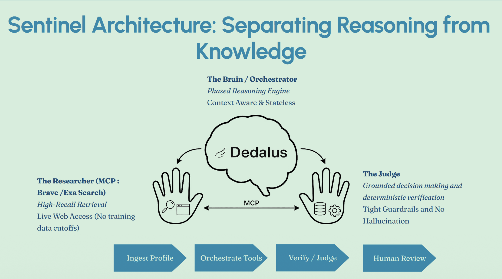

# Sentinel: MCP-Native Agentic AI Compliance Adjudication Pipeline

Sentinel is an **agentic AI pipeline for autonomous compliance adjudication** in financial services. It ingests a customer profile, gathers relevant evidence, produces a decision with citations, and supports a **human-in-the-loop** review loop.

Sentinel follows a strict, repeatable workflow designed for **traceability, auditability, and low-hallucination risk**.

---

## Agentic AI Workflow


### 1) Researcher: High-Recall Evidence Gathering

* Enriches the subject using customer profile attributes.
* Searches for potential adverse media using MCP-connected tools (e.g., Exa Search).
* Maximizes recall while avoiding fabrication: **no evidence → no claims**.

### 2) Analyst: Identity & Relevance Filter

* Treats name matches as **non-matches by default** until identity is verified.
* Uses negative constraints to eliminate false positives (e.g., mismatched age, location, employer, or role).
* If evidence is insufficient or ambiguous, routes the case to **Manual Review**.

### 3) Judge: Final Adjudication

* Produces a structured **Decision Card** including:

  * Verdict + confidence
  * One-line rationale
  * Source links (citations)
* Outputs a machine-readable JSON summary for downstream workflows.

Humans can review or override agent outputs when needed. The result is **grounded, traceable, production-ready decisions** with built-in oversight.

---

## 🔌 MCP Integration

Sentinel is **MCP-native**: external systems are accessed through MCP connectors, enabling:

* **Structured tool invocation**
* **Traceable evidence trails**
* **Replayable runs**
* **Reduced hallucination risk**

### Integrated MCP Connectors

* **Customer Information MCP** (Capital One Nessie Hackathon API)
* **Search MCP** (Exa / external web search)
* **Dedalus SDK** (agent runner & orchestration)

---

## 🏗 Principles

* **Grounded by design:** every claim must tie back to evidence.
* **Separation of reasoning & knowledge:** agents reason; MCP tools retrieve.
* **Deterministic guardrails:** verification rules constrain the final decision.
* **Human-in-the-loop:** ambiguous cases escalate to manual review.
* **Auditability:** decisions are explainable and sources are preserved.

---

## Getting Started (Local Development)

### Prerequisites

* Python 3.10+
* Node.js 18+
* API keys for:

  * Dedalus SDK
  * Capital One Nessie Hackathon API

---

## Backend Setup

```bash
cd backend
python -m venv .venv
source .venv/bin/activate
pip install -r requirements.txt
```

Create a `.env` file inside `backend/`:

```bash
DEDALUS_API_KEY=YOUR_DEDALUS_API_KEY
NESSIE_API_KEY=YOUR_NESSIE_API_KEY
```

Populate the Nessie database with `testdata.json`.

Run the backend in dev mode:

```bash
fastapi dev main.py
```

---

## Frontend Setup

In `frontend/app/page.tsx`, set:

```ts
const API_URL = "http://localhost:8000"
```

Then run:

```bash
cd frontend
npm install
npm run dev
```

* Frontend: `http://localhost:3000`

---

## Usage

1. Start the backend and frontend.
2. Select a customer or case in the UI.
3. Click **Start Adjudication**.
4. Watch live reasoning steps stream in.
5. Review the final decision and:

   * Approve / Close
   * Escalate for manual review

---

## Security & Auditability

To maintain compliance integrity:

* Attach citations for every claim.
* Log tool inputs/outputs (excluding secrets).
* Implement clear escalation thresholds.
* Keep deterministic validation separate from LLM reasoning.
